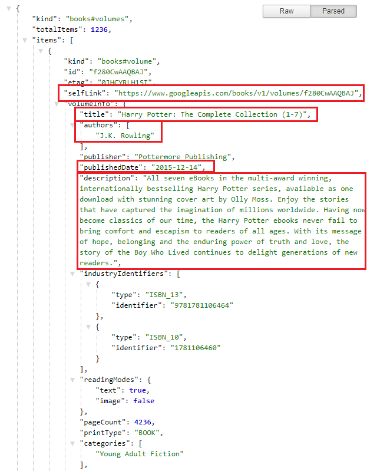

[](https://opensource.org/licenses/MIT)<br>

# Googly-Search

Our application leverages Google Books API to bring back the most important content from your favorite books. You can then save them into your own collection so you can reference them later.

Please checkout our [application!](https://googly-search.herokuapp.com/)


Table of Contents

1. [Technology](#technology)
2. [Schema](#schema)
3. [Utils](#utils)
4. [React Components](https://github.com/dnovelli1/classproject#react-components)
5. [Usage & Features](https://github.com/dnovelli1/classproject#usage--features)
6. [License](#license)
7. [Future Development](https://github.com/dnovelli1/classproject#future-development)
8. [Contact Us](https://github.com/dnovelli1/classproject#contact-us)

<br>
<hr>
<br>

## Technology

 &nbsp;
 &nbsp;
 &nbsp;
 &nbsp;
 &nbsp;
 &nbsp;
 &nbsp;
 &nbsp;
 &nbsp;
 &nbsp;
 &nbsp;
 &nbsp;
 &nbsp;

<br><br>

Here are the technologies and tools used to build this application.

- HTML
- CSS
- JavaScript
- [Bootstrap](https://getbootstrap.com/)
- [React](https://reactjs.org/)
    - [react-bootstrap](https://react-bootstrap.github.io/)
- [Node.js](https://nodejs.org/en/)
- [npm](https://www.npmjs.com/) packages
    - [axios](https://www.npmjs.com/package/axios)
    - [express](https://www.npmjs.com/package/express)
    - [if-env](https://www.npmjs.com/package/if-env)
    - [mongoose](https://www.npmjs.com/package/mongoose)

- [HEROKU](https://www.heroku.com/)
- [Atlas mongoDB](https://www.mongodb.com/)


## Schema

Our book schema to store the **google api** response has 6 properties not including the **_id** that mongoose assigns.

```BookSchema
var BookSchema = new Schema({
    name: {
        type: String,
    },
    author: {
        type: String,
    },
    publishedDate: {
        type: String
    },
    description: {
        type: String
    },
    image: {
        type: String,
    },
    link: {
        type: String,
        required: 'URL can\'t be empty',
    }
})
```


## Utils

On the client side, we have these 4 utility functions to make an api call to our server.

``` Utils
  // Get book based on search
  getBooks: function(book) {
      return axios.get('https://www.googleapis.com/books/v1/volumes?q=' + book)
  },
  // Get list of saved books in database
  getSavedBooks: function() {
      return axios.get('/api/books')
  },
  // Save book to database
  saveBook: function(bookData) {
      return axios.post('/api/books', bookData)
      // Mongoose
  },
  // Delete book from database
  deleteBook: function(bookId) {
      return axios.delete('/api/books/' + bookId)
      //Mongoose 
  },
```


## React Components

Here is our **src** folder directory with its many components and pages:
``` src folder
<!-- Within our 'client' folder: -->

src
├── components
│   ├── Book
│   │   └── Book.js
│   ├── Jumbotron
│   │   └── Jumbotron.js
│   ├── Main
│   │   └── Main.js
│   ├── Navbar
│   │   └── Navbar.js
│   ├── SavedBook
│   │   └── SavedBook.js
│   └── Search
│       └── Search.js
├── pages
│   └── Home.js
│   └── Saved.js
├── utils
│   └── API.js
├── App.js
├── index.css
├── index.js
└── registerServiceWorker.js
```

## Usage & Features

**Google Books API**
When calling on the `API.getBooks` we deconstructed the json response so later on downstream in our code it is easier to handle. If you look at about the middle section of the code snippet below you can see where we push in the deconstructed object into **newData**. Inside the object contains; *name, author, publishedDate, description, image, link*.

```API.getBooks deconstuction
<!-- json deconstruction -->

  handleSearchbutton = () => {
  API.getBooks(this.state.search)
  .then(res => {
    const newData = [];
    console.log(res);
    res.data.items.forEach((book)=>{
      let imageURL;
      if(book.volumeInfo.imageLinks){
        imageURL = book.volumeInfo.imageLinks.thumbnail;
      }else{
        imageURL = "";
      }
      newData.push({
            name: book.volumeInfo.title,
            author: book.volumeInfo.authors[0],
            publishedDate: book.volumeInfo.publishedDate,
            description:book.volumeInfo.description,
            image: imageURL,
            link: book.selfLink
      });
    });
    this.setState({ books: newData })
  });
}
```

Here is a snippet of what the **Google Books API** response looks like before we deconstruct it. *(not all fields are highlighted below)*




**MongoDB**

We use MongoDB on the backend to store the user's **Saved** books where they can *view, add, and delete books from their **Saved** list. Shown below are our mongoose constructor functions:

``` API endpoints and mongoose constructors
<!-- Server-side API endpoints and mongoose constructor functions -->

router.get('/books', (req, res) => {
  Book.find({})
    .then(bookData => {
      res.status(200).json(bookData);
    })
    .catch(err => {
      res.status(500).json(err)
    })
});

router.post('/books', (req, res) => {
  Book.create(req.body)
    .then(bookData => {
      res.status(200).json(bookData);
    })
    .catch(err => {
      console.log(err)
      res.status(500).json(err)
    })
});

router.delete('/books/:id', async (req, res) => {
  Book.remove({ _id: req.params.id })
    .then(bookData => {
      res.status(200).json(bookData);
    })
    .catch(err => {
      console.log(err)
      res.status(500).json({ message: "Book not found" })
    })
});
```

Here you can see how a user's **Saved** books list and them deleting a book.


## License

MIT License

Copyright (c) 2021 Jake Novelli, Cheng Tang, Liam Stewart, and Dylan Couzon

Permission is hereby granted, free of charge, to any person obtaining a copy
of this software and associated documentation files (the "Software"), to deal
in the Software without restriction, including without limitation the rights
to use, copy, modify, merge, publish, distribute, sublicense, and/or sell
copies of the Software, and to permit persons to whom the Software is
furnished to do so, subject to the following conditions:

The above copyright notice and this permission notice shall be included in all
copies or substantial portions of the Software.

THE SOFTWARE IS PROVIDED "AS IS", WITHOUT WARRANTY OF ANY KIND, EXPRESS OR
IMPLIED, INCLUDING BUT NOT LIMITED TO THE WARRANTIES OF MERCHANTABILITY,
FITNESS FOR A PARTICULAR PURPOSE AND NONINFRINGEMENT. IN NO EVENT SHALL THE
AUTHORS OR COPYRIGHT HOLDERS BE LIABLE FOR ANY CLAIM, DAMAGES OR OTHER
LIABILITY, WHETHER IN AN ACTION OF CONTRACT, TORT OR OTHERWISE, ARISING FROM,
OUT OF OR IN CONNECTION WITH THE SOFTWARE OR THE USE OR OTHER DEALINGS IN THE
SOFTWARE.


## Future Development

Some future development opportunities are:
- onSubmit for the Search bar on the HomePage
- Interactive confirmation that item is saved i.e. removing the card for Book when it is saved
- Fix hero image sizing inside of Jumbotron

## Contact Us

Please feel free to reach out to us or checkout our other individual works.

Jake Novelli
- [jakenovelli11@gmail.com](mailto:jakenovelli11@gmail.com)
- [GitHub](https://github.com/dnovelli1)
- [LinkedIn](https://www.linkedin.com/in/david-jacob-novelli/)

Dylan Couzon
- [dylancouzon@gmail.com](mailto:dylancouzon@gmail.com)
- [GitHub](https://github.com/Dylancouzon)
- [LinkedIn](https://www.linkedin.com/in/dcouzon/)

Liam Stewart
- [liamchristopher.media@gmail.com](mailto:liamchristopher.media@gmail.com)
- [GitHub](https://github.com/LiamStewart8)
- [LinkedIn](https://www.linkedin.com/in/liamsctewart/)

Cheng Tang
- [cheng21tang@gmail.com](mailto:cheng21tang@gmail.com)
- [GitHub](https://github.com/cheng21tang)
- [LinkedIn](https://www.linkedin.com/in/cheng21tang/)
